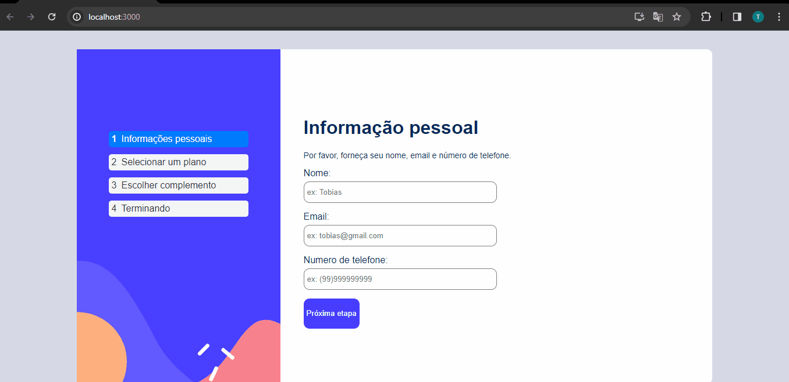

# Multi Step Form
Essa aplicação consiste em um formulário com várias etapas, onde o usuário escolhe seu plano de antivírus, seja ele mensal ou anual, e mais adicionais. Ao  final do formulário é exibido um resumo do plano e dos adicionais escolhidos. Além da aplicação está no formata para desktop, ela está responsiva para dispositivos mobile.

## Instalação
1. Clone o repositório: git clone https://github.com/tobiasramos/multi-step-form.git
2. Acesse o diretório do projeto: cd multi-step-form
3. Instale as dependências: npm install

## Uso
1. Execute o projeto localmente: npm start
2. Abra o navegador e acesse: http://localhost:3000

## Tecnologias utilizadas
 - HTML
 - CSS
 - JAVASCRIPT
 - REACTJS
 - STYLED COMPONENTS
 - JEST/REACT TESTING LIBRARY

## Projeto em execução
